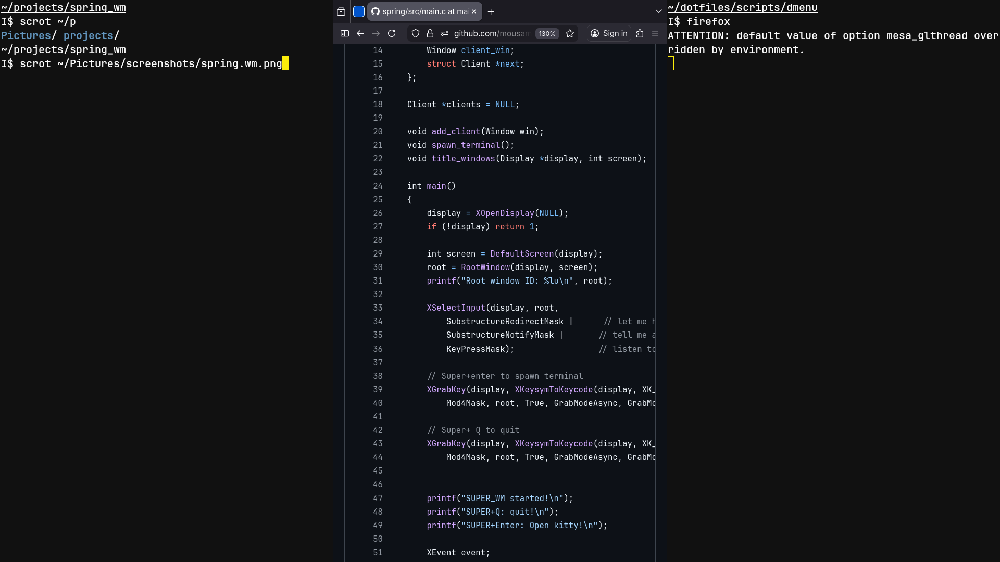

# SPRING X Window Manager (Learning Project)

A minimal tiling window manager written in C for educational purposes. Currently in early development with basic X11 connectivity and keyboard input handling.

## Current Status



## TODO List
- [x] X11 server connection and event loop
- [x] Basic keyboard shortcuts (SUPER+Enter, SUPER+Q)
- [x] Initial tiling layout logic
- [x] window gap
- [ ] Mouse resize and move 

## Building & Running
```bash
make
make run
```

## Dependencies
- X11 development libraries
- GCC or Clang
- Make
- Xephyr

## Resources
- dwm
- tinyWM
- sowm
- swm/wmutils
- berry

